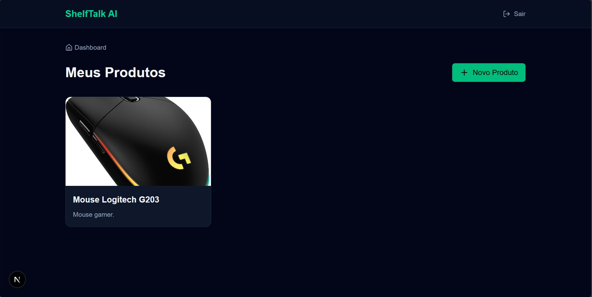
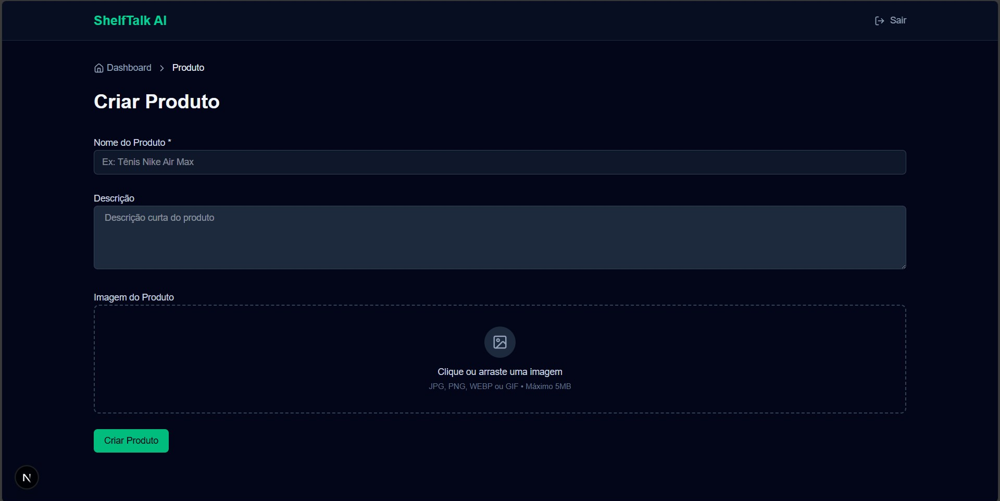
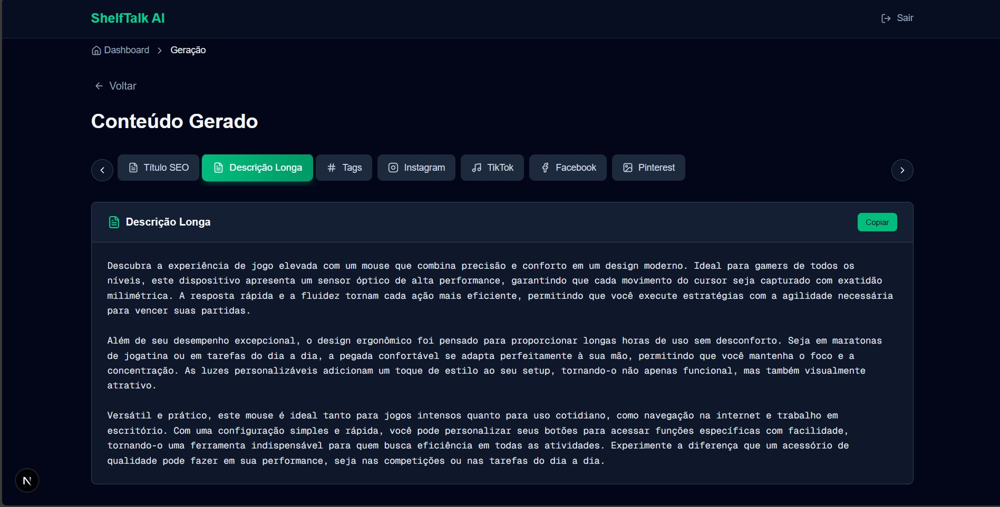
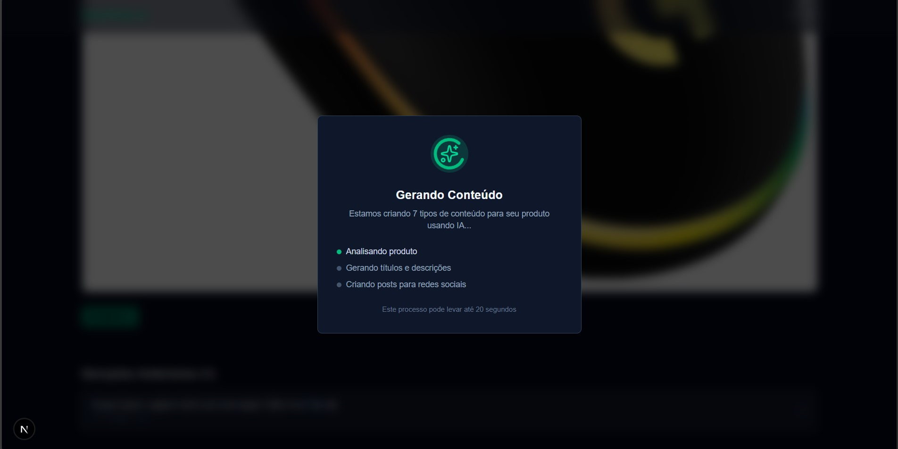

# 🛍️ ShelfTalk AI

**Geração inteligente de conteúdo para e-commerce usando IA multimodal**

Uma plataforma full-stack que utiliza GPT-4o-mini com Vision AI para gerar automaticamente títulos SEO, descrições, tags e posts para 4 redes sociais (Instagram, TikTok, Facebook, Pinterest) a partir de produtos cadastrados.

[](https://www.typescriptlang.org/)
[](https://nextjs.org/)
[](https://nestjs.com/)
[](https://www.postgresql.org/)
[](https://openai.com/)
[](https://www.docker.com/)

---

## 🎯 Sobre o Projeto

ShelfTalk AI foi desenvolvido como projeto técnico para demonstrar expertise em:
- Arquitetura full-stack moderna
- Integração com APIs de IA (OpenAI GPT-4o-mini)
- Vision AI multimodal (análise de imagens)
- Orquestração de múltiplos pipelines em paralelo
- Autenticação JWT e segurança
- Testes E2E automatizados

**Caso de uso:** Lojistas e profissionais de e-commerce que precisam criar conteúdo otimizado rapidamente para múltiplos canais.

---

## ✨ Features

### 🤖 IA Multimodal
- ✅ **Vision AI**: Análise automática de imagens (cores, materiais, estilo, características)
- ✅ **7 tipos de conteúdo gerados simultaneamente** em ~5 segundos
- ✅ **Pipelines especializadas** com temperatura ajustada por tipo de conteúdo
- ✅ **Contexto enriquecido**: Análise visual alimenta todas as gerações

### 📦 Gestão de Produtos
- ✅ CRUD completo de produtos
- ✅ Upload de imagens com drag & drop e preview
- ✅ Validação de tipo e tamanho de arquivo
- ✅ Armazenamento com UUID único

### 📱 Conteúdo para Redes Sociais
- ✅ **Instagram**: Tom aspiracional, hashtags, emojis estratégicos
- ✅ **TikTok**: Linguagem jovem, dinâmica, CTAs fortes
- ✅ **Facebook**: Storytelling, conversacional, público amplo
- ✅ **Pinterest**: Inspiração, descoberta, usos do produto

### 🔐 Autenticação & Segurança
- ✅ JWT com expiração de 7 dias
- ✅ Bcrypt com 10 salt rounds
- ✅ Validação de ownership (usuário só acessa seus próprios dados)
- ✅ DTOs com class-validator em todas as entradas

### 🎨 UI/UX
- ✅ Loading states profissionais com skeletons
- ✅ Toast notifications para feedback
- ✅ Tabs navegáveis para visualização de conteúdo
- ✅ Copy-to-clipboard com um clique
- ✅ Breadcrumbs e navegação intuitiva

---

## 🏗️ Arquitetura
```
┌─────────────────────────────────────────────────────────┐
│                    USUÁRIO (Browser)                     │
└────────────────────┬────────────────────────────────────┘
                     │
                     ▼
┌─────────────────────────────────────────────────────────┐
│              FRONTEND (Next.js 16)                       │
│  • App Router (Server + Client Components)              │
│  • TypeScript strict mode                               │
│  • Server-side cookies para auth                        │
│  • API Routes como BFF (Backend for Frontend)           │
└────────────────────┬────────────────────────────────────┘
                     │ HTTP + JWT
                     ▼
┌─────────────────────────────────────────────────────────┐
│              BACKEND (NestJS)                            │
│  • RESTful API                                           │
│  • Dependency Injection                                  │
│  • Guards (JWT Auth)                                     │
│  • Multer (Upload de imagens)                           │
│  • 5 Pipelines de IA especializadas                     │
└────────────────────┬────────────────────────────────────┘
                     │
        ┌────────────┼────────────┐
        ▼            ▼            ▼
    ┌───────┐  ┌──────────┐  ┌────────┐
    │PostgreSQL TypeORM  │  │OpenAI  │
    │  (DB)  │  │ (ORM)   │  │  API   │
    └────────┘  └──────────┘  └────────┘
```

---

## 🛠️ Stack Técnica

### Backend
- **Framework:** NestJS 10 (Node.js + TypeScript)
- **ORM:** TypeORM 0.3 (Active Record)
- **Banco de Dados:** PostgreSQL 15
- **Autenticação:** JWT (Passport + @nestjs/jwt)
- **Validação:** class-validator + class-transformer
- **Upload:** Multer (diskStorage)
- **IA:** LangChain + OpenAI SDK
  - GPT-4o-mini (text generation)
  - GPT-4o-mini-vision (image analysis)
- **Testes:** Jest + Supertest (E2E)

### Frontend
- **Framework:** Next.js 16.0.1 (App Router)
- **UI:** React 19 + TypeScript
- **Styling:** Tailwind CSS 4
- **Componentes:** shadcn/ui (Radix UI)
- **Notificações:** react-hot-toast
- **Ícones:** lucide-react
- **HTTP:** Fetch API nativa

### DevOps
- **Containerização:** Docker + Docker Compose
- **PostgreSQL:** 15 (containerizado)
- **Redis:** 7 (preparado para cache futuro)
- **CI/CD:** Pronto para GitHub Actions
- **Monitoramento:** Logs estruturados (NestJS Logger)

---

## 📊 Pipelines de IA

### 1. Vision Analysis Pipeline
- **Modelo:** GPT-4o-mini-vision
- **Input:** Imagem do produto (base64)
- **Output:** JSON estruturado
```json
  {
    "category": "calçado esportivo",
    "colors": ["branco", "azul"],
    "style": "moderno, esportivo",
    "materials": ["sintético", "borracha"],
    "features": ["solado com amortecimento"],
    "detailedDescription": "Tênis esportivo..."
  }
```
- **Temperatura:** 0.3 (análise objetiva)
- **Tempo:** ~3s

### 2. Title Pipeline
- **Objetivo:** Título SEO otimizado
- **Temperatura:** 0.5 (balanceado)
- **Max Length:** 80 caracteres
- **Tempo:** ~1.5s

### 3. Long Description Pipeline
- **Objetivo:** Descrição detalhada (2-4 parágrafos)
- **Temperatura:** 0.7 (criativo)
- **Tempo:** ~1.5s

### 4. Tags Pipeline
- **Objetivo:** Palavras-chave separadas por vírgula
- **Temperatura:** 0.6 (moderado)
- **Max Tags:** 10
- **Tempo:** ~1.5s

### 5. Social Post Pipeline (4 canais)
- **Objetivo:** Posts otimizados por rede social
- **Temperatura:** 0.9 (alta criatividade)
- **Canais:** Instagram, TikTok, Facebook, Pinterest
- **Tempo:** ~1.5s cada (paralelo)

**Total:** 7 conteúdos em ~5 segundos (com paralelização)

---

## 🚀 Como Rodar Localmente

### Pré-requisitos
- Node.js 20+
- Docker + Docker Compose
- OpenAI API Key

### 1. Clone o Repositório
```bash
git clone https://github.com/soares-ari/shelftalk-ai.git
cd shelftalk-ai
```

### 2. Configure Variáveis de Ambiente

**Infra** (`infra/.env`):
```env
POSTGRES_USER=postgres
POSTGRES_PASSWORD=postgres
POSTGRES_DB=shelftalk
```

**Backend** (`backend/.env`):
```env
# Database
POSTGRES_HOST=localhost
POSTGRES_PORT=5432
POSTGRES_USER=postgres
POSTGRES_PASSWORD=postgres
POSTGRES_DB=shelftalk

# Auth
JWT_SECRET=your-super-secret-jwt-key-change-in-production

# OpenAI
OPENAI_API_KEY=sk-proj-...

# Server
PORT=3001
```

**Frontend** (`frontend/.env.local`):
```env
NEXT_PUBLIC_API_URL=http://localhost:3001
```

### 3. Suba os Serviços Docker
```bash
docker-compose -f infra/docker-compose.yml up -d
```

Isso irá iniciar:
- **PostgreSQL 15** na porta 5432
- **Redis 7** na porta 6379

Aguarde ~10 segundos para o PostgreSQL inicializar completamente.

### 4. Instale Dependências

**Backend:**
```bash
cd backend
npm install
```

**Frontend:**
```bash
cd frontend
npm install
```

### 5. Execute os Serviços

**Backend** (Terminal 1):
```bash
cd backend
npm run start:dev
# Disponível em http://localhost:3001
```

**Frontend** (Terminal 2):
```bash
cd frontend
npm run dev
# Disponível em http://localhost:3000
```

### 6. Acesse a Aplicação
Abra [http://localhost:3000](http://localhost:3000) no navegador.

### 7. Teste o Sistema

1. **Registre um usuário:** Email + senha
2. **Faça login:** Receba JWT token
3. **Crie um produto:** Nome + descrição + imagem
4. **Gere conteúdo:** Clique em "Gerar Conteúdo"
5. **Visualize resultado:** 7 tipos de conteúdo em ~5 segundos

---

## 🐳 Docker

### Serviços Disponíveis

O projeto usa Docker Compose para orquestrar os serviços de infraestrutura:

| Serviço | Imagem | Porta | Descrição |
|---------|--------|-------|-----------|
| PostgreSQL | postgres:15 | 5432 | Banco de dados principal |
| Redis | redis:7 | 6379 | Cache (preparado para uso futuro) |

### Comandos Úteis

**Iniciar serviços:**
```bash
docker-compose -f infra/docker-compose.yml up -d
```

**Parar serviços:**
```bash
docker-compose -f infra/docker-compose.yml down
```

**Ver logs:**
```bash
docker-compose -f infra/docker-compose.yml logs -f postgres
docker-compose -f infra/docker-compose.yml logs -f redis
```

**Resetar banco de dados:**
```bash
docker-compose -f infra/docker-compose.yml down -v  # Remove volumes
docker-compose -f infra/docker-compose.yml up -d    # Recria
```

**Acessar PostgreSQL diretamente:**
```bash
docker exec -it shelftalk-postgres psql -U postgres -d shelftalk
```

### Troubleshooting Docker

**Erro: "port 5432 already in use"**
```bash
# Verifique se já tem PostgreSQL rodando localmente
sudo lsof -i :5432
# Pare o PostgreSQL local ou mude a porta no infra/docker-compose.yml
```

**Erro: "database does not exist"**
```bash
# Recrie o container
docker-compose -f infra/docker-compose.yml down -v
docker-compose -f infra/docker-compose.yml up -d
```

### Volumes

Os dados do PostgreSQL são persistidos no volume `postgres_data`, garantindo que os dados não sejam perdidos ao reiniciar os containers.

### Nota sobre Redis

O **Redis está configurado** mas não está sendo usado atualmente. Está preparado para futuras implementações de:
- Cache de queries
- Rate limiting
- Session storage
- Queue de jobs

---

## 🧪 Testes

### Backend - Testes E2E
```bash
cd backend
npm run test:e2e
```

**Cobertura:**
- ✅ Autenticação (registro, login, JWT validation)
- ✅ Produtos (CRUD, upload de imagem, ownership)
- ✅ Gerações (multimodal, Vision AI, 7 pipelines)

**Estatísticas:**
- **37 testes** passando
- **3 suítes** (auth, products, generations)
- **Tempo:** ~45s
- **Custo por execução:** ~$0.005 USD

**Executar testes específicos:**
```bash
npm run test:e2e:auth        # Apenas autenticação
npm run test:e2e:products    # Apenas produtos
npm run test:e2e:generations # Apenas gerações (IA)
```

---

## 📂 Estrutura do Projeto
```
shelftalk-ai/
├── backend/
│   ├── src/
│   │   ├── auth/              # Autenticação JWT
│   │   ├── users/             # Gerenciamento de usuários
│   │   ├── products/          # CRUD de produtos
│   │   ├── generations/       # Orquestração de gerações
│   │   ├── ai/                # Pipelines de IA
│   │   │   ├── pipelines/
│   │   │   │   ├── title.pipeline.ts
│   │   │   │   ├── long-description.pipeline.ts
│   │   │   │   ├── tags.pipeline.ts
│   │   │   │   ├── social-post.pipeline.ts
│   │   │   │   └── vision-analysis.pipeline.ts
│   │   │   └── ai.service.ts
│   │   ├── config/            # Configurações (DB, Multer)
│   │   └── main.ts            # Bootstrap
│   ├── test/
│   │   └── e2e/               # Testes E2E
│   ├── uploads/               # Armazenamento de imagens
│   └── package.json
│
├── frontend/
│   ├── src/
│   │   ├── app/               # App Router (Next.js 16)
│   │   │   ├── api/           # API Routes (BFF)
│   │   │   ├── login/
│   │   │   ├── register/
│   │   │   ├── dashboard/
│   │   │   ├── products/
│   │   │   └── generations/
│   │   └── components/
│   │       ├── ui/            # Componentes base (shadcn)
│   │       ├── products/      # Componentes de produtos
│   │       ├── generations/   # Visualização de gerações
│   │       └── layout/        # Layout components
│   └── package.json
│
├── infra/
│   ├── docker-compose.yml     # Orquestração de serviços
│   └── .env                   # Variáveis do Docker
│
└── README.md
```

---

## 🎨 Screenshots

### Dashboard

*Listagem de produtos com ações rápidas*

### Criação de Produto

*Upload de imagem com drag & drop e preview*

### Visualização de Conteúdo

*Tabs navegáveis com 7 tipos de conteúdo gerado*

### Loading State

*Feedback visual durante geração (~5s)*

---

## 🔒 Segurança

- ✅ **Senhas:** Hash bcrypt com 10 salt rounds
- ✅ **JWT:** Assinatura HS256, expiração de 7 dias
- ✅ **Validação:** class-validator em todos os DTOs
- ✅ **Ownership:** Verificação em todas as operações
- ✅ **Whitelist:** Remove campos maliciosos automaticamente
- ✅ **CORS:** Configurado apenas para origens permitidas
- ✅ **Upload:** Validação de tipo (MIME) e tamanho (5MB)

---

## 📈 Performance

### Otimizações Implementadas
- ✅ **Paralelização:** 7 gerações em paralelo (Promise.all)
- ✅ **Caching:** TypeORM query cache
- ✅ **Índices:** Criados em colunas frequentemente consultadas
- ✅ **Lazy Loading:** Componentes carregados sob demanda

### Métricas
- **Tempo de geração:** ~5s (com Vision AI)
- **Tempo de carregamento inicial:** <500ms
- **Tokens por geração:** ~3.000
- **Custo por geração:** ~$0.003 USD

---

## 🚧 Roadmap

### Versão 1.1
- [ ] Sistema de templates personalizáveis
- [ ] Histórico com comparação entre gerações
- [ ] Export em múltiplos formatos (CSV, JSON, PDF)
- [ ] Agendamento de posts

### Versão 2.0
- [ ] Multi-tenancy (suporte a múltiplas empresas)
- [ ] Integração direta com APIs de redes sociais
- [ ] A/B testing de conteúdo
- [ ] Analytics de performance

---

## 🤝 Contribuindo

Contributions são bem-vindas! Para contribuir:

1. Fork o projeto
2. Crie uma branch (`git checkout -b feature/AmazingFeature`)
3. Commit suas mudanças (`git commit -m 'Add: nova feature incrível'`)
4. Push para a branch (`git push origin feature/AmazingFeature`)
5. Abra um Pull Request

---

## 📝 Licença

Este projeto é licenciado sob a MIT License - veja o arquivo [LICENSE](LICENSE) para detalhes.

---

## 👨‍💻 Autor

**Ariel Soares**

- LinkedIn: [linkedin.com/in/ari-soares](https://linkedin.com/in/ari-soares)
- GitHub: [github.com/soares-ari](https://github.com/soares-ari)
- Email: ariel.b.p.soares@gmail.com

---

## 🙏 Agradecimentos

- [OpenAI](https://openai.com/) pela API GPT-4o-mini
- [NestJS](https://nestjs.com/) pelo framework backend
- [Next.js](https://nextjs.org/) pelo framework frontend
- [shadcn/ui](https://ui.shadcn.com/) pelos componentes UI

---

**⭐ Se este projeto te ajudou, considere dar uma estrela!**